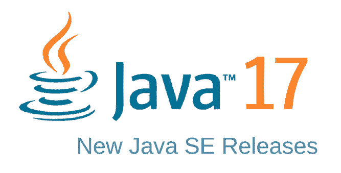

# COMP2120 Assignment 3 - Dungeons Project

    
    

#
| Team Members | Roles |
| ------ | ------ |
| Qiutong Zeng (u7724723) | Responsible for CI/CD pipline, dockerfile, movement logic of player |
| Christo Antony (u7701030) | Responsible for all the game logic, maze interface and task allocation|
| Xiaotian  Cheng (u7769920) | Responsible for NPC, items logic and help menu|
| Charles Dino (u7140320)     |Responsible for all the document writing        |

***

## Overview
The Dungeons project focuses on a simple text-based, rogue-like adventure game to generate an experience wherein the player navigates a series of mazes - collecting items, interacting with NPCs and battling enemies - in order to reach the exit.
The premise follows an adventure into a forgotten temple in search of treasure, and the game features interactive entities and obstacles marked with special characters, three levels of varying sizes, and the capacity to view the map overview and the player's health and inventory.

## Installation & Setup
Consult the project's following GitLab Wiki [page](https://gitlab.cecs.anu.edu.au/u7724723/comp2120-fri10_a3_c/-/wikis/Installation-&-Setup) for a guide on installation and setup instructions.

## Project Licence
This project is licensed under Apache License 2.0. See [LICENSE](https://gitlab.cecs.anu.edu.au/u7724723/comp2120-fri10_a3_c/-/blob/main/LICENSE) file in the root directory for more information.

